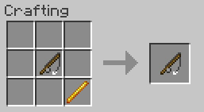

# Grapple mod for Minecraft

Have you ever played Sh\*tbow Ann\*hilation?

### MC Versions
1.7.10   
1.9.4    
1.10.x   
1.11.x   
1.12.x  
1.13.2 (aplha)

### Downloads
[jar.oiran.org](http://jar.oiran.org/g/)

### Usage
1. Install minecarft-forge
2. Go to `.minecraft\mods` and drop `grapple-xxx-xxx.zip`
3. Run minecraft
4. Craft fishing rod and blaze rod to make 'Grapple'
      

### Config
detail: [jar.oiran.org](http://jar.oiran.org/g/#c)

### Video
[nicovideo.jp](http://www.nicovideo.jp/watch/sm31956875)

### Known Issue

* Too dinamic movement compared to Sh\*tbow Scout 

### License
You are allowed to modify this mod code and distribute your modified version of grapple mod, but please care about compliance and [THE LISENCE OF MCP](https://gist.github.com/Techcable/de37e364ab35194df3e8).   
It is you who are responsible for any risk by this mod.   
You can include this mod in your modpack without contact to me.

### Caution
Redistributed version of this mod may contain abused codes. So, be careful when you use redistributed version.

### Future 
Grapple Mod for Fabric will come soon... but it's too tough I believe   
- \[TODO\] New enchantment, armour enchantment which softens falldamage and gives swiftness effect etc.
- \[TODO\] Configuration
